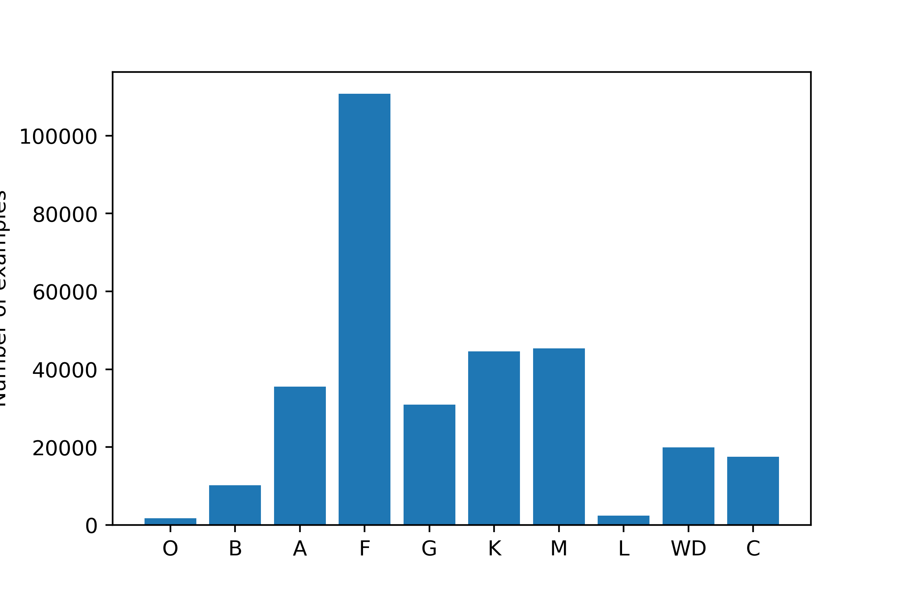

# Automatic classification of SDSS (BOSS/eBOSS) spectra using a deep learning approach

The code in this repository was part of an undergraduate summer research internship at Pontificia Universidad Catolica de Chile. The main goal of the work was to learn about basic deep learning techniques and apply them to develop a model able to tell quasars apart from stars in spectroscopic data,
inspired in the work of [Busca, 2018](https://arxiv.org/abs/1808.09955).
Originally, the training dataset had to contain the spectra of all the sources listed in the Million Quasar Catalog v5.7 ([MILLIQUAS](http://quasars.org/milliquas.htm)) and in the future it might. However, it was easier to first select data from a single instrument of a single survey to rule out resolution and spectral range differences. Most of the spectroscopically confirmed quasars in MILLIQUAS come from the SDSS DR14 Quasar Catalog ([DR14Q](https://arxiv.org/abs/1712.05029)) anyway, so the exclusion of non-SDSS data isn't a problem by now.

## The Dataset

The full dataset contains 765824 BOSS spectra: 446869 from quasars, 318955 from stars and 22795 galaxies. The stellar spectra were selected from DR15 with the only restriction of being BOSS spectra. Their spectral type label was simply taken from the `subClass` columns of the `SpecObjAll` table. Galaxy spectra were selected from the human confirmed sources in the DR12Q (an earlier version of  DR14Q) superset. Each spectrum was max-normalized and downsampled from about 4000 datapoints to 433, in a fixed log-wavelength interval ranging from 3.56 $\log\AA$ to 4.01 $\log\AA$. Also, every spectrum was labeled with a ground-truth class either from DR14Q (in the case of quasar spectra) or from the SDSS automatic classification routines (in the case of stellar spectra). There were 12 distinct classes: QSO, BAL (Broad absorption line quasar), O, B, A, F, G, K, M, L, WD (White Dwarfs) and C (Carbon stars).  Below is a bar chart showing the distribution of spectral types within the stellar sample used in this work:  
  

Meanwhile, the quasar sample contains 21877 BAL quasars and 424992 normal quasars. 

### Download the data

The fully processed dataset will soon be available on Kaggle. By now, it can be constructed by manually downloading the raw data and then applying the reduction pipeline. Look for the textfiles in the data folder of this repo, in them you'll find all the URLs to the FITS files. I suggest to use  ``wget``. For example, to retrieve all the quasar spectra into the ``data/quasarboss`` directory:
```sh
wget -nd -nv -r -nH -i data/quasarboss-urls.txt -P data/quasarboss
```
Note: The total size of these files (only quasars) is 66GB, so the download may take several hours to complete.

 Once the download is ready, you may want to reduce the size of the files by removing unnecessary data columns and HDUs. This can be acomplished with the `shrink` command:
```sh
chmod +x shrink
./shrink data/quasarboss
# If everything is alright:
rm data/quasarboss -rfv
mv data/quasarboss_ultralight data/quasarboss
```
 This is an optional step but it might save you a lot of disk space. With this procedure, every file is reduced in size by a factor of 3.

 Then you can create a HDF5 file containing the subsampled spectra and it's labels. With the following command, the file should include two datasets, `fluxes` with shape `(788539, 433)` and `classes` with shape `(788539,13)`: 
```sh
./preprocess.py filelist.txt
# Where filelist.txt contains the path to every selected FITS file
```
If the execution does not halt due to errors, it will write the processed data into a file named `dataset788539_433t_13c.h5` with an aproximate size of 1.4 GB.

### Notebooks
The notebooks in this repo include a detailed discussion of the methods used and the problems I encountered while developing this project.  

## The Model
The proposed architecture has 5  1d-convolutional layers and a fully connected layer at the end. All activations are ReLU, except for the last layer which uses softmax. Details of each layer are shown in the following diagram:


### Download pretrained weights
You can download the pretrained weights from kaggle. These were obtained by optimising a categorical cross-entropy loss with the Adam optimizer (with default settings) during 26 epochs on a GPU-accelerated runtime in Google Collab 
## Results

## TODO
- [ ] Reformat dataset to upload to kaggle 
- [ ] Add a runable demo notebook
- [ ] Add usage instructions and user friendliness
- [ ] Clean wrong labeled stars from the sample (by comparing with DR12Q superset)
- [ ] Add signal-to-noise ratio data to the input of the net. In this way I hope the classifier will give better generalization, and avoid misclassification of very faint objects.
- [ ] Incorporate redshift estimation as a multi-task regression problem
- [ ] Add spectra from different surveys
- [ ] Better quality asessment